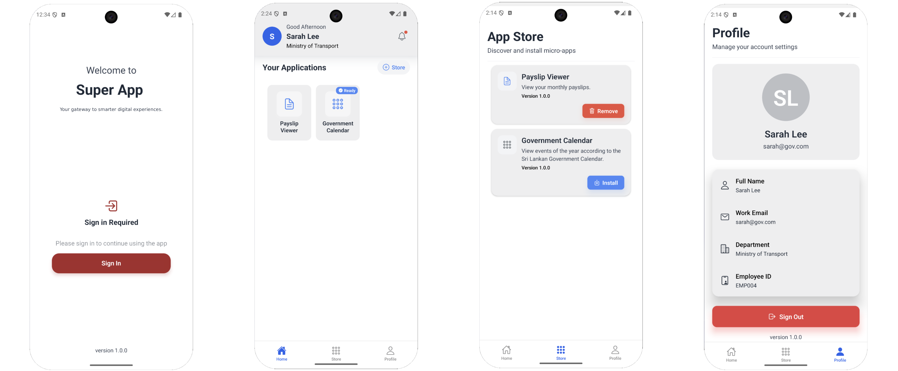
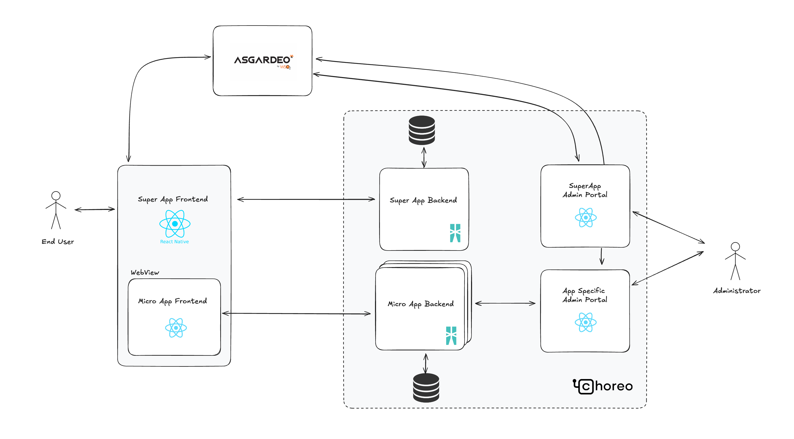
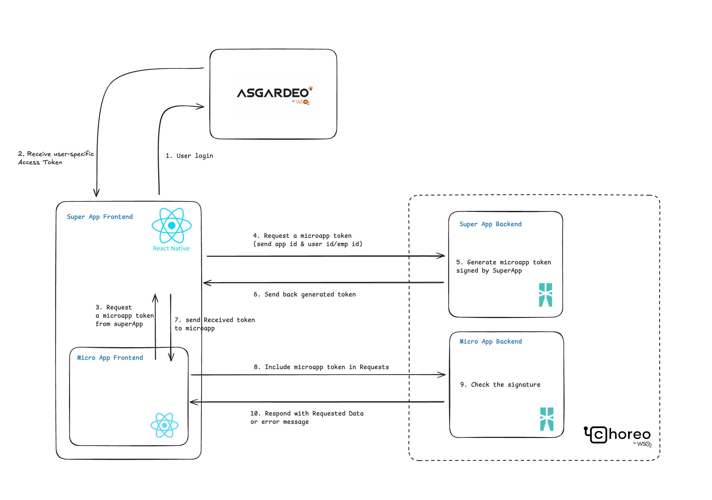

<h1 align="left">Super App Mobile</h1>


<br></br>
<p align="left">
  <a href="https://opensource.org/license/apache-2-0">
    
  </a>
</p>
This repository is the foundation for hosting and managing many small web-based micro-apps with seamless authentication, secure token exchange, and centralized management. Micro-apps run inside the host app and communicate with it using a lightweight, reliable bridge, making onboarding and integration straightforward for both in-house and third‑party apps.


## 🧭 Project Structure

```bash
.
├── backend                  # Ballerina backend service
│   └── README.md            # Detailed backend documentation
├── frontend                 # React Native Super App
│   └── README.md            # Detailed frontend documentation
├── README.md                # You're here
```

## ⚙️ Technologies Used

### Backend
- **Language**: [Ballerina](https://ballerina.io/)
- **Authentication**: Handled via [Asgardeo](https://wso2.com/asgardeo/)
- **Deployment**: Hosted on [Choreo](https://wso2.com/choreo/)

### Frontend
- **Framework**: React Native (Expo)
- **State Management**: Redux with Thunk
- Micro-app management, token exchange, and secure storage


## 🧱 System Architecture

Here’s a high-level view of the flow:
<br></br>


## 🧱 Authentication Flow



## 🚀 Getting Started

Each part of this repository has its own setup guide:

- [Frontend](./frontend/README.md)
- [Backend](./backend/README.md)

## 🐞 Reporting Issues

###  1. Opening an issue

All known issues of LSF Superapp Mobile are filed at: https://github.com/LSFLK/superapp-mobile/issues. Please check this list before opening a new issue.

<!-- ### 2.  Reporting security issues

Please do not report security issues via GitHub issues. Instead, follow the [WSO2 Security Vulnerability Reporting Guidelines](https://security.docs.wso2.com/en/latest/security-reporting/vulnerability-reporting-guidelines/). -->

## 🤝 Contributing

If you are planning on contributing to the development efforts of LSF Superapp Mobile, you can do so by checking out the latest development version. The main branch holds the latest unreleased source code.
