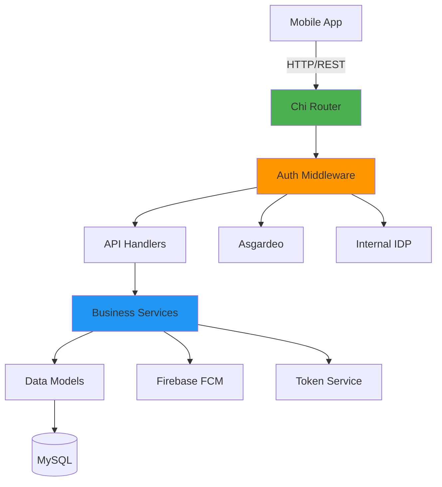
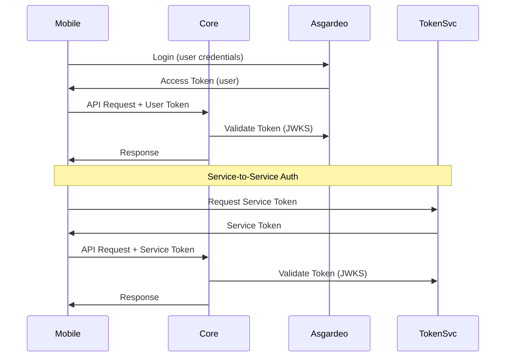
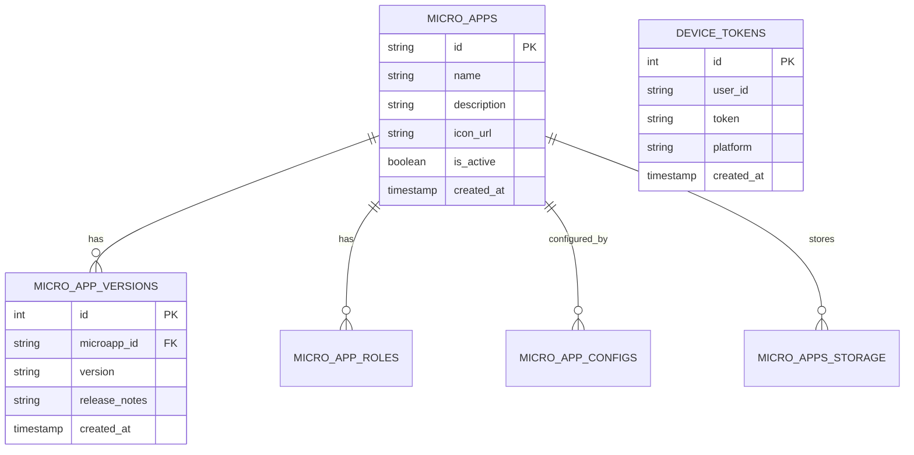

# Core Service - Developer Guide

## Table of Contents
- [Overview](#overview)
- [Architecture](#architecture)
- [Prerequisites](#prerequisites)
- [Environment Setup](#environment-setup)
- [Database Setup](#database-setup)
- [Running Locally](#running-locally)
- [Building for Production](#building-for-production)
- [Testing](#testing)
- [API Documentation](#api-documentation)
- [Adding New Endpoints](#adding-new-endpoints)
- [Troubleshooting](#troubleshooting)

---

## Overview

The Core Service is the main backend API for the LSF Super App. It handles all business logic including microapp management, user configurations, push notifications, and file storage.

**Key Responsibilities:**
- Microapp CRUD operations and versioning
- User configuration management
- Push notifications via Firebase Cloud Messaging
- File storage (database-based)
- Authentication and authorization (dual IDP support)
- Device token management

**Tech Stack:**
- **Language:** Go 1.25.4
- **HTTP Router:** Chi v5
- **ORM:** GORM
- **Database:** MySQL 8.0+
- **Authentication:** JWT (Asgardeo + Internal IDP)
- **Push Notifications:** Firebase Admin SDK
- **API Docs:** Swagger/OpenAPI

---

## Architecture

### Service Architecture



### Project Structure

```
services/core/
├── cmd/
│   └── server/
│       └── main.go              # Application entry point
├── internal/
│   ├── api/v1/
│   │   ├── dto/                 # Data Transfer Objects
│   │   ├── handler/             # HTTP request handlers
│   │   └── router/              # Route definitions
│   ├── auth/                    # Authentication middleware
│   ├── config/                  # Configuration management
│   ├── database/                # Database connection
│   ├── models/                  # Database models
│   ├── router/                  # Main router setup
│   └── services/                # Business logic services
├── migrations/                  # SQL migration scripts
├── .env.example                 # Environment variables template
├── go.mod                       # Go module definition
└── DEVELOPER_GUIDE.md          # This file
```

### Authentication Flow



---

## Prerequisites

### Required Software
- **Go:** 1.25.4 or higher ([Download](https://golang.org/dl/))
- **MySQL:** 8.0 or higher ([Download](https://dev.mysql.com/downloads/mysql/))
- **Git:** For version control
- **Firebase Project:** With Admin SDK credentials

### Optional Tools
- **Air:** For hot reload during development
- **Postman/Insomnia:** For API testing
- **MySQL Workbench:** For database management

### Installation Commands

```bash
# Install Go (macOS with Homebrew)
brew install go

# Install MySQL (macOS with Homebrew)
brew install mysql
brew services start mysql

# Install Air for hot reload
go install github.com/air-verse/air@latest

# Install Swag for API docs
go install github.com/swaggo/swag/cmd/swag@latest
```

---

## Environment Setup

### 1. Clone and Navigate

```bash
cd /path/to/superapp-mobile/services/core
```

### 2. Install Dependencies

```bash
go mod download
```

### 3. Configure Environment Variables

```bash
# Copy example environment file
cp .env.example .env

# Edit .env with your settings
nano .env  # or use your preferred editor
```

### 4. Environment Variables Reference

```bash
# Database Configuration
DB_USER=root                      # MySQL username
DB_PASSWORD=your_password         # MySQL password
DB_HOST=localhost                 # Database host
DB_PORT=3306                      # Database port
DB_NAME=superapp_db              # Database name
DB_MAX_OPEN_CONNS=25             # Max open connections
DB_MAX_IDLE_CONNS=5              # Max idle connections
DB_CONN_MAX_LIFETIME_MIN=30      # Connection max lifetime (minutes)
DB_CONN_MAX_IDLE_TIME_MIN=5      # Connection max idle time (minutes)
DB_CONNECT_RETRIES=5             # Connection retry attempts

# Server Configuration
SERVER_PORT=9090                  # HTTP server port

# External IDP (Asgardeo) - for user authentication
EXTERNAL_IDP_JWKS_URL=https://api.asgardeo.io/t/your-org/oauth2/jwks
EXTERNAL_IDP_ISSUER=https://api.asgardeo.io/t/your-org/oauth2/token
EXTERNAL_IDP_AUDIENCE=your-client-id

# Internal IDP (Token Service) - for service-to-service auth
INTERNAL_IDP_BASE_URL=http://localhost:8081
INTERNAL_IDP_ISSUER=superapp-idp
INTERNAL_IDP_AUDIENCE=superapp-api

# Service Configuration
USER_SERVICE_TYPE=db              # User service type (db)
FILE_SERVICE_TYPE=db              # File service type (db)

# Firebase Configuration
FIREBASE_CREDENTIALS_PATH=./path/to/firebase-admin-key.json
```

> [!IMPORTANT]
> **Firebase Setup:** Download your Firebase Admin SDK JSON file from the Firebase Console (Project Settings → Service Accounts → Generate New Private Key) and update the path in `.env`.

---

## Database Setup

### 1. Create Database

```bash
# Connect to MySQL
mysql -u root -p

# Create database
CREATE DATABASE superapp_db CHARACTER SET utf8mb4 COLLATE utf8mb4_unicode_ci;

# Verify
SHOW DATABASES;

# Exit
exit
```

### 2. Run Migrations

```bash
# From services/core directory
mysql -u root -p superapp_db < migrations/001_init_schema.sql
```

### 3. Verify Tables

```bash
mysql -u root -p superapp_db

SHOW TABLES;
# Expected tables:
# - micro_apps
# - micro_app_versions
# - micro_app_roles
# - micro_app_configs
# - device_tokens
# - notification_logs
# - micro_apps_storage

exit
```

### Database Schema



---

## Running Locally

### Method 1: Direct Run

```bash
# From services/core directory
go run cmd/server/main.go
```

Output:
```
2025/12/03 20:00:00 INFO Starting server port=9090
```

### Method 2: With Hot Reload (Recommended)

```bash
# Install air if not already installed
go install github.com/air-verse/air@latest

# Run with hot reload
air
```

Air will watch for file changes and automatically rebuild and restart the server.

### Method 3: Build and Run

```bash
# Build binary
go build -o bin/core-service cmd/server/main.go

# Run binary
./bin/core-service
```

### Verify Service is Running

```bash
# Check health (if health endpoint exists)
curl http://localhost:9090/api/v1/health

# Check Swagger UI
open http://localhost:9090/swagger/index.html
```

---

## Building for Production

### 1. Build Optimized Binary

```bash
# Build with optimizations
CGO_ENABLED=0 GOOS=linux GOARCH=amd64 go build \
  -ldflags="-w -s" \
  -o bin/core-service \
  cmd/server/main.go
```

Flags explained:
- `CGO_ENABLED=0` - Disable CGO for static binary
- `GOOS=linux` - Target OS
- `GOARCH=amd64` - Target architecture
- `-ldflags="-w -s"` - Strip debug info (smaller binary)

### 2. Docker Build

```dockerfile
# Example Dockerfile
FROM golang:1.25.4-alpine AS builder
WORKDIR /app
COPY go.mod go.sum ./
RUN go mod download
COPY . .
RUN CGO_ENABLED=0 go build -ldflags="-w -s" -o core-service cmd/server/main.go

FROM alpine:latest
RUN apk --no-cache add ca-certificates
WORKDIR /root/
COPY --from=builder /app/core-service .
COPY --from=builder /app/migrations ./migrations
EXPOSE 9090
CMD ["./core-service"]
```

Build and run:
```bash
docker build -t core-service:latest .
docker run -p 9090:9090 --env-file .env core-service:latest
```

---

## Testing

### Run All Tests

```bash
# Run all tests
go test ./...

# Run with verbose output
go test -v ./...

# Run with coverage
go test -cover ./...

# Generate coverage report
go test -coverprofile=coverage.out ./...
go tool cover -html=coverage.out
```

### Run Specific Package Tests

```bash
# Test handlers
go test ./internal/api/v1/handler/...

# Test services
go test ./internal/services/...

# Test auth middleware
go test ./internal/auth/...
```

### Writing Tests

Example test structure:

```go
package handler_test

import (
    "testing"
    "net/http/httptest"
)

func TestGetMicroapps(t *testing.T) {
    // Setup
    // ...
    
    // Execute
    req := httptest.NewRequest("GET", "/api/v1/microapps", nil)
    w := httptest.NewRecorder()
    handler.ServeHTTP(w, req)
    
    // Assert
    if w.Code != 200 {
        t.Errorf("expected 200, got %d", w.Code)
    }
}
```

---

## API Documentation

### Accessing Swagger UI

Once the service is running, access the interactive API documentation at:

**http://localhost:9090/swagger/index.html**

### Generating/Updating Swagger Docs

```bash
# Generate Swagger documentation
swag init -g cmd/server/main.go

# This creates/updates:
# - docs/docs.go
# - docs/swagger.json
# - docs/swagger.yaml
```

### Adding Swagger Annotations

Example handler with Swagger annotations:

```go
// GetMicroapps godoc
// @Summary List all microapps
// @Description Get all active microapps available to the user
// @Tags microapps
// @Accept json
// @Produce json
// @Security BearerAuth
// @Success 200 {array} dto.MicroappResponse
// @Failure 401 {object} ErrorResponse
// @Failure 500 {object} ErrorResponse
// @Router /api/v1/microapps [get]
func (h *MicroappHandler) GetMicroapps(w http.ResponseWriter, r *http.Request) {
    // Implementation
}
```

---

## Adding New Endpoints

Follow these steps to add a new API endpoint:

### 1. Define DTO (Data Transfer Object)

Create in `internal/api/v1/dto/`:

```go
// internal/api/v1/dto/example_dto.go
package dto

type ExampleRequest struct {
    Name        string `json:"name" validate:"required"`
    Description string `json:"description"`
}

type ExampleResponse struct {
    ID          string `json:"id"`
    Name        string `json:"name"`
    Description string `json:"description"`
    CreatedAt   string `json:"created_at"`
}
```

### 2. Create Handler

Create in `internal/api/v1/handler/`:

```go
// internal/api/v1/handler/example_handler.go
package handler

import (
    "encoding/json"
    "net/http"
    "go-backend/internal/api/v1/dto"
)

type ExampleHandler struct {
    // dependencies
}

// CreateExample godoc
// @Summary Create example
// @Description Create a new example resource
// @Tags examples
// @Accept json
// @Produce json
// @Security BearerAuth
// @Param request body dto.ExampleRequest true "Example data"
// @Success 201 {object} dto.ExampleResponse
// @Failure 400 {object} ErrorResponse
// @Router /api/v1/examples [post]
func (h *ExampleHandler) CreateExample(w http.ResponseWriter, r *http.Request) {
    var req dto.ExampleRequest
    if err := json.NewDecoder(r.Body).Decode(&req); err != nil {
        http.Error(w, err.Error(), http.StatusBadRequest)
        return
    }
    
    // Business logic here
    
    w.WriteHeader(http.StatusCreated)
    json.NewEncoder(w).Encode(response)
}
```

### 3. Register Route

Update `internal/api/v1/router/router.go`:

```go
func SetupRoutes(r chi.Router, db *gorm.DB, cfg *config.Config) {
    // ... existing routes
    
    exampleHandler := handler.NewExampleHandler(db)
    r.Post("/examples", exampleHandler.CreateExample)
    r.Get("/examples/{id}", exampleHandler.GetExample)
}
```

### 4. Regenerate Swagger Docs

```bash
swag init -g cmd/server/main.go
```

### 5. Test the Endpoint

```bash
curl -X POST http://localhost:9090/api/v1/examples \
  -H "Content-Type: application/json" \
  -H "Authorization: Bearer YOUR_TOKEN" \
  -d '{"name":"Test","description":"Test description"}'
```

---

## Troubleshooting

### Common Issues

#### 1. Database Connection Failed

**Error:** `Error connecting to database: dial tcp: connection refused`

**Solutions:**
```bash
# Check if MySQL is running
brew services list | grep mysql

# Start MySQL
brew services start mysql

# Test connection
mysql -u root -p

# Verify credentials in .env match MySQL user
```

#### 2. Firebase Initialization Failed

**Error:** `Failed to initialize Firebase: invalid credentials`

**Solutions:**
- Verify `FIREBASE_CREDENTIALS_PATH` points to correct file
- Check file permissions: `chmod 644 firebase-admin-key.json`
- Validate JSON format: `cat firebase-admin-key.json | jq`
- Download fresh credentials from Firebase Console

#### 3. Token Validation Failed

**Error:** `Invalid token: failed to fetch JWKS`

**Solutions:**
```bash
# Check token service is running
curl http://localhost:8081/.well-known/jwks.json

# Verify INTERNAL_IDP_BASE_URL in .env
# Should be: http://localhost:8081

# Check network connectivity
ping localhost
```

#### 4. Port Already in Use

**Error:** `bind: address already in use`

**Solutions:**
```bash
# Find process using port 9090
lsof -i :9090

# Kill the process
kill -9 <PID>

# Or change port in .env
SERVER_PORT=9091
```

#### 5. Module Import Errors

**Error:** `package go-backend/internal/... is not in GOROOT`

**Solutions:**
```bash
# Clean module cache
go clean -modcache

# Re-download dependencies
go mod download

# Tidy dependencies
go mod tidy

# Verify go.mod module name matches imports
```

#### 6. Swagger UI Not Loading

**Solutions:**
```bash
# Regenerate Swagger docs
swag init -g cmd/server/main.go

# Verify docs directory exists
ls -la docs/

# Check if Swagger route is registered
# Should have: r.Get("/swagger/*", ...)
```

### Debug Mode

Enable detailed logging:

```go
// In main.go or config
slog.SetLogLoggerLevel(slog.LevelDebug)
```

### Performance Issues

```bash
# Profile CPU usage
go test -cpuprofile=cpu.prof -bench=.
go tool pprof cpu.prof

# Profile memory usage
go test -memprofile=mem.prof -bench=.
go tool pprof mem.prof
```

---

## Additional Resources

- [Go Documentation](https://golang.org/doc/)
- [Chi Router](https://github.com/go-chi/chi)
- [GORM Documentation](https://gorm.io/docs/)
- [Firebase Admin SDK](https://firebase.google.com/docs/admin/setup)
- [Swagger/OpenAPI](https://swagger.io/docs/)

---

## Support

For deployment instructions, see [../DEPLOYMENT_GUIDE.md](../DEPLOYMENT_GUIDE.md)

For service overview, see [../README.md](../README.md)
