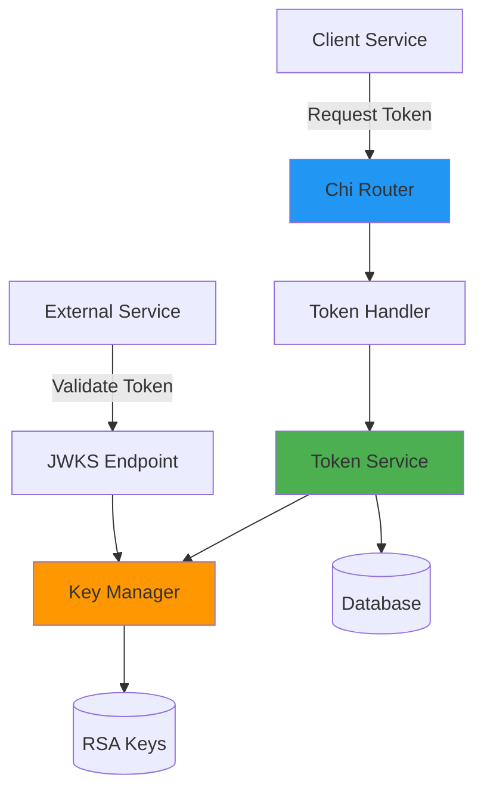
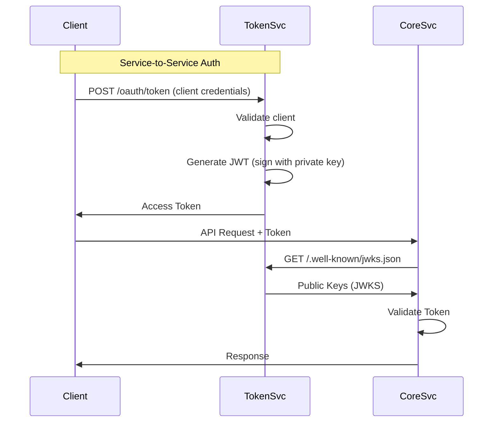

# Token Service - Developer Guide

## Table of Contents
- [Overview](#overview)
- [Architecture](#architecture)
- [Prerequisites](#prerequisites)
- [Environment Setup](#environment-setup)
- [Key Management](#key-management)
- [Running Locally](#running-locally)
- [Building for Production](#building-for-production)
- [Testing](#testing)
- [API Documentation](#api-documentation)
- [Zero-Downtime Key Rotation](#zero-downtime-key-rotation)
- [Troubleshooting](#troubleshooting)

---

## Overview

The Token Service (also known as go-idp) is an internal Identity Provider that handles JWT token generation and validation for service-to-service authentication and microapp frontend authorization.

**Key Responsibilities:**
- Generate JWT tokens for service-to-service communication
- Provide JWKS endpoint for public key distribution
- Support zero-downtime RSA key rotation
- OAuth2 client credentials flow
- User token exchange for microapp frontends

**Tech Stack:**
- **Language:** Go 1.25.4
- **HTTP Router:** Chi v5
- **ORM:** GORM
- **Database:** MySQL 8.0+ / SQLite (for testing)
- **Cryptography:** RSA-256 for JWT signing
- **API Docs:** Swagger/OpenAPI

---

## Architecture

### Service Architecture



### Project Structure

```
services/token-service/
├── cmd/
│   └── server/
│       └── main.go              # Application entry point
├── internal/
│   ├── api/v1/
│   │   ├── handler/             # HTTP request handlers
│   │   └── router/              # Route definitions
│   ├── config/                  # Configuration management
│   ├── models/                  # Database models
│   └── services/                # Business logic (token generation)
├── keys/                        # RSA key pairs directory
│   └── dev/                     # Development keys
├── scripts/
│   ├── generate-keys.sh         # Key generation script
│   └── generate-jwks.go         # JWKS generation utility
├── docs/
│   └── KEY_ROTATION.md          # Key rotation guide
├── .env.example                 # Environment variables template
├── go.mod                       # Go module definition
└── DEVELOPER_GUIDE.md          # This file
```

### Token Flow



---

## Prerequisites

### Required Software
- **Go:** 1.25.4 or higher ([Download](https://golang.org/dl/))
- **MySQL:** 8.0 or higher ([Download](https://dev.mysql.com/downloads/mysql/))
- **OpenSSL:** For key generation (usually pre-installed on macOS/Linux)

### Optional Tools
- **Air:** For hot reload during development
- **jq:** For JSON processing

### Installation Commands

```bash
# Install Go (macOS with Homebrew)
brew install go

# Install MySQL (macOS with Homebrew)
brew install mysql
brew services start mysql

# Install Air for hot reload
go install github.com/air-verse/air@latest

# Install jq for JSON processing
brew install jq
```

---

## Environment Setup

### 1. Navigate to Service Directory

```bash
cd /path/to/superapp-mobile/services/token-service
```

### 2. Install Dependencies

```bash
go mod download
```

### 3. Configure Environment Variables

```bash
# Copy example environment file
cp .env.example .env

# Edit .env with your settings
nano .env  # or use your preferred editor
```

### 4. Environment Variables Reference

```bash
# Server Configuration
PORT=8081                         # HTTP server port

# Database Configuration
DB_USER=root                      # MySQL username
DB_PASSWORD=your_password         # MySQL password
DB_HOST=127.0.0.1                # Database host
DB_PORT=3306                      # Database port
DB_NAME=superapp                  # Database name

# Key Configuration (Option 1: Single-key mode - backward compatible)
# PRIVATE_KEY_PATH=./keys/dev/dev-key-example_private.pem
# PUBLIC_KEY_PATH=./keys/dev/dev-key-example_public.pem
# JWKS_PATH=./keys/dev/dev-key-example_jwks.json

# Key Configuration (Option 2: Directory mode - recommended for production)
# Load all keys from directory for zero-downtime rotation
KEYS_DIR=./keys/dev
ACTIVE_KEY_ID=dev-key-example

# Token Configuration
TOKEN_EXPIRY_SECONDS=3600         # Token expiry (1 hour)
```

> [!IMPORTANT]
> **Key Configuration:** Use `KEYS_DIR` mode for production to enable zero-downtime key rotation. Single-key mode is only for development/testing.

---

## Key Management

### Generating RSA Keys

The service requires RSA key pairs for signing and verifying JWT tokens.

#### Quick Start (Development)

```bash
# Generate a new key pair using the provided script
./scripts/generate-keys.sh

# This creates:
# - keys/dev/dev-key-<timestamp>_private.pem
# - keys/dev/dev-key-<timestamp>_public.pem
# - keys/dev/dev-key-<timestamp>_jwks.json
```

#### Manual Key Generation

```bash
# Create keys directory
mkdir -p keys/dev

# Generate private key (2048-bit RSA)
openssl genrsa -out keys/dev/my-key_private.pem 2048

# Extract public key
openssl rsa -in keys/dev/my-key_private.pem \
  -pubout -out keys/dev/my-key_public.pem

# Generate JWKS (JSON Web Key Set)
go run scripts/generate-jwks.go \
  -public keys/dev/my-key_public.pem \
  -kid my-key \
  -output keys/dev/my-key_jwks.json
```

### Key Directory Structure

For zero-downtime rotation, organize keys like this:

```
keys/dev/
├── key-2024-12-01_private.pem
├── key-2024-12-01_public.pem
├── key-2024-12-01_jwks.json
├── key-2024-12-15_private.pem    # New key
├── key-2024-12-15_public.pem
└── key-2024-12-15_jwks.json
```

The service loads ALL keys from the directory and uses `ACTIVE_KEY_ID` for signing new tokens.

---

## Running Locally

### Method 1: Direct Run

```bash
# From services/token-service directory
go run cmd/server/main.go
```

Output:
```
2025/12/03 20:00:00 INFO Starting token service port=8081
2025/12/03 20:00:00 INFO Loaded 2 key(s) from directory
2025/12/03 20:00:00 INFO Active signing key: dev-key-example
```

### Method 2: With Hot Reload (Recommended)

```bash
# Install air if not already installed
go install github.com/air-verse/air@latest

# Run with hot reload
air
```

### Method 3: Build and Run

```bash
# Build binary
go build -o bin/token-service cmd/server/main.go

# Run binary
./bin/token-service
```

### Verify Service is Running

```bash
# Check JWKS endpoint
curl http://localhost:8081/.well-known/jwks.json | jq

# Expected output:
# {
#   "keys": [
#     {
#       "kty": "RSA",
#       "kid": "dev-key-example",
#       "use": "sig",
#       "alg": "RS256",
#       "n": "...",
#       "e": "AQAB"
#     }
#   ]
# }

# Check Swagger UI
open http://localhost:8081/swagger/index.html
```

---

## Building for Production

### 1. Build Optimized Binary

```bash
# Build with optimizations
CGO_ENABLED=0 GOOS=linux GOARCH=amd64 go build \
  -ldflags="-w -s" \
  -o bin/token-service \
  cmd/server/main.go
```

### 2. Docker Build

```dockerfile
# Example Dockerfile
FROM golang:1.25.4-alpine AS builder
WORKDIR /app
COPY go.mod go.sum ./
RUN go mod download
COPY . .
RUN CGO_ENABLED=0 go build -ldflags="-w -s" -o token-service cmd/server/main.go

FROM alpine:latest
RUN apk --no-cache add ca-certificates
WORKDIR /root/
COPY --from=builder /app/token-service .
COPY --from=builder /app/keys ./keys
EXPOSE 8081
CMD ["./token-service"]
```

Build and run:
```bash
docker build -t token-service:latest .
docker run -p 8081:8081 --env-file .env token-service:latest
```

---

## Testing

### Run All Tests

```bash
# Run all tests
go test ./...

# Run with verbose output
go test -v ./...

# Run with coverage
go test -cover ./...

# Generate coverage report
go test -coverprofile=coverage.out ./...
go tool cover -html=coverage.out
```

### Run Specific Tests

```bash
# Test token service
go test ./internal/services/...

# Test handlers
go test ./internal/api/v1/handler/...
```

### Example Test

```go
func TestTokenGeneration(t *testing.T) {
    tokenSvc := services.NewTokenService(/* ... */)
    
    token, err := tokenSvc.GenerateToken("test-client", "test-audience")
    if err != nil {
        t.Fatalf("failed to generate token: %v", err)
    }
    
    // Validate token
    claims, err := tokenSvc.ValidateToken(token)
    if err != nil {
        t.Fatalf("failed to validate token: %v", err)
    }
    
    if claims.Subject != "test-client" {
        t.Errorf("expected subject test-client, got %s", claims.Subject)
    }
}
```

---

## API Documentation

### Accessing Swagger UI

Once the service is running, access the interactive API documentation at:

**http://localhost:8081/swagger/index.html**

### Key Endpoints

| Endpoint | Method | Description |
|----------|--------|-------------|
| `/.well-known/jwks.json` | GET | Public keys (JWKS) for token validation |
| `/oauth/token` | POST | Generate access token (client credentials) |
| `/api/v1/users/{userId}/token` | POST | Generate user token for microapp |
| `/health` | GET | Health check endpoint |

### Generating/Updating Swagger Docs

```bash
# Generate Swagger documentation
swag init -g cmd/server/main.go

# This creates/updates:
# - docs/docs.go
# - docs/swagger.json
# - docs/swagger.yaml
```

---

## Zero-Downtime Key Rotation

The token service supports zero-downtime key rotation, allowing you to rotate signing keys without service interruption.

### How It Works

1. **Multiple Keys:** Service loads all keys from `KEYS_DIR`
2. **Active Key:** New tokens are signed with `ACTIVE_KEY_ID`
3. **Validation:** Tokens can be validated with ANY loaded key
4. **JWKS:** All public keys are exposed via JWKS endpoint

### Rotation Process

#### Step 1: Generate New Key

```bash
# Generate new key pair
./scripts/generate-keys.sh

# Output:
# Generated: keys/dev/dev-key-20251203_private.pem
# Generated: keys/dev/dev-key-20251203_public.pem
# Generated: keys/dev/dev-key-20251203_jwks.json
```

#### Step 2: Update Active Key

```bash
# Update .env
ACTIVE_KEY_ID=dev-key-20251203
```

#### Step 3: Restart Service

```bash
# Restart the service
# New tokens will be signed with the new key
# Old tokens remain valid (validated with old key)
```

#### Step 4: Wait for Token Expiry

```bash
# Wait for old tokens to expire (default: 1 hour)
# Monitor token usage if needed
```

#### Step 5: Remove Old Key (Optional)

```bash
# After all old tokens have expired, remove old key
rm keys/dev/dev-key-20241201_*
```

### Automation Example

```bash
#!/bin/bash
# rotate-keys.sh - Automated key rotation

# Generate new key
NEW_KEY_ID="prod-key-$(date +%Y%m%d)"
./scripts/generate-keys.sh $NEW_KEY_ID

# Update configuration
sed -i '' "s/ACTIVE_KEY_ID=.*/ACTIVE_KEY_ID=$NEW_KEY_ID/" .env

# Restart service (example for systemd)
sudo systemctl restart token-service

# Schedule old key removal (after token expiry)
echo "rm keys/prod/old-key-*" | at now + 2 hours
```

For detailed rotation guide, see [docs/KEY_ROTATION.md](./docs/KEY_ROTATION.md)

---

## Troubleshooting

### Common Issues

#### 1. Keys Not Found

**Error:** `Failed to load keys: no keys found in directory`

**Solutions:**
```bash
# Generate keys
./scripts/generate-keys.sh

# Verify keys exist
ls -la keys/dev/

# Check KEYS_DIR in .env
cat .env | grep KEYS_DIR

# Ensure directory path is correct (relative to binary location)
```

#### 2. Invalid Key Format

**Error:** `Failed to parse private key: invalid key`

**Solutions:**
```bash
# Verify key format
openssl rsa -in keys/dev/key_private.pem -check

# Regenerate if corrupted
./scripts/generate-keys.sh

# Check file permissions
chmod 600 keys/dev/*_private.pem
chmod 644 keys/dev/*_public.pem
```

#### 3. JWKS Endpoint Returns Empty

**Error:** JWKS returns `{"keys":[]}`

**Solutions:**
```bash
# Check if keys are loaded
# Look for log: "Loaded X key(s) from directory"

# Verify JWKS files exist
ls -la keys/dev/*_jwks.json

# Regenerate JWKS
go run scripts/generate-jwks.go \
  -public keys/dev/key_public.pem \
  -kid key-id \
  -output keys/dev/key_jwks.json
```

#### 4. Token Validation Failed

**Error:** `Token validation failed: signature is invalid`

**Solutions:**
- Ensure token was signed with a key that's loaded in the service
- Check `ACTIVE_KEY_ID` matches an existing key
- Verify public/private key pair matches
- Check token hasn't expired

```bash
# Decode JWT to inspect (without validation)
echo "YOUR_TOKEN" | cut -d. -f2 | base64 -d | jq

# Check kid (key ID) in token header
echo "YOUR_TOKEN" | cut -d. -f1 | base64 -d | jq
```

#### 5. Database Connection Failed

**Error:** `Failed to connect to database`

**Solutions:**
```bash
# Check MySQL is running
brew services list | grep mysql

# Test connection
mysql -u root -p -h 127.0.0.1

# Verify credentials in .env
cat .env | grep DB_

# Check database exists
mysql -u root -p -e "SHOW DATABASES;"
```

#### 6. Port Already in Use

**Error:** `bind: address already in use`

**Solutions:**
```bash
# Find process using port 8081
lsof -i :8081

# Kill the process
kill -9 <PID>

# Or change port in .env
PORT=8082
```

### Debug Mode

Enable detailed logging:

```go
// In main.go
slog.SetLogLoggerLevel(slog.LevelDebug)
```

### Testing Token Generation

```bash
# Generate token via API
curl -X POST http://localhost:8081/oauth/token \
  -H "Content-Type: application/json" \
  -d '{
    "grant_type": "client_credentials",
    "client_id": "test-client",
    "client_secret": "test-secret"
  }' | jq

# Decode token
TOKEN="eyJhbGc..."
echo $TOKEN | cut -d. -f2 | base64 -d | jq
```

---

## Additional Resources

- [JWT.io](https://jwt.io/) - JWT debugger
- [JWKS Specification](https://datatracker.ietf.org/doc/html/rfc7517)
- [OAuth 2.0 Client Credentials](https://oauth.net/2/grant-types/client-credentials/)
- [RSA Cryptography](https://en.wikipedia.org/wiki/RSA_(cryptosystem))

---

## Support

For deployment instructions, see [../DEPLOYMENT_GUIDE.md](../DEPLOYMENT_GUIDE.md)

For service overview, see [../README.md](../README.md)

For key rotation details, see [docs/KEY_ROTATION.md](./docs/KEY_ROTATION.md)
