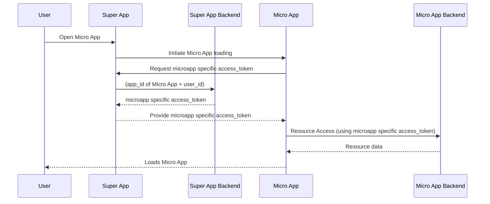

# 🚀 Super App Mobile (React Native \+ Expo)

The **Mobile App** is an all-in-one platform designed to bring essential tools and services to your fingertips for a seamless mobile experience. Built with **React Native + Expo**, **TypeScript**, and **Redux**, this Super App integrates secure authentication via **External IdP**, a micro-app architecture, and a dynamic app store for downloading and managing features.

---
## 🚀 Getting Started

### Prerequisites

Before setting up the project, ensure you have the following installed:

- **Node.js** (v18 or higher)
- **npm** or **yarn** package manager
- **Expo CLI**: `npm install -g @expo/cli`
- **Git** for version control
- **Xcode** (for iOS development on macOS)
- **Android Studio** (for Android development)

### Project Setup

1. **Clone the Repository**
   ```bash
   git clone <repository-url>
   cd gov-sup-app/superapp-mobile/frontend
   ```

2. **Install Dependencies**
   ```bash
   npm install
   ```

3. **Environment Configuration**
   ```bash
   cp .env.example .env
   ```

   Fill in the required environment variables in `.env`:
   ```bash
   EXPO_PUBLIC_CLIENT_ID=<project-client-id-from-idp>
   EXPO_PUBLIC_REDIRECT_URI=<redirect-uri-from-idp>
   EXPO_PUBLIC_TOKEN_URL=<token-url-from-idp>
   EXPO_PUBLIC_LOGOUT_URL=<logout-url-from-idp>
   EXPO_PUBLIC_BACKEND_BASE_URL=<backend-api-url>
   ```

4. **Start Development Server**
   ```bash
   npm start
   ```


## 🚀 Deployment

### Build Process

1. **Development Builds**
   ```bash
   # Android APK
   npx expo prebuild --platform android --clean // To pre-build the package
   npx expo run:android --variant=debug

   # iOS Simulator
   npx expo prebuild --platform ios --clean 
   npx expo run:ios
   ```
In the output, you'll find options to open the app in a

- [Development build](https://docs.expo.dev/develop/development-builds/introduction/)
- [Android emulator](https://docs.expo.dev/workflow/android-studio-emulator/)
- [iOS simulator](https://docs.expo.dev/workflow/ios-simulator/)
- [Expo Go](https://expo.dev/go), a limited sandbox for trying out app development with Expo

You can start development by editing the files inside the **app** directory. This project uses [file-based routing](https://docs.expo.dev/router/introduction).   

2. **Production Builds**
   ```bash
   # Using EAS Build
   npx eas build --platform android
   npx eas build --platform ios

   # Or using Expo Application Services
   npx expo build:android
   npx expo build:ios
   ```

## Available Scripts

```bash
# Start Expo development server
npm start

# Run on Android emulator/device
npm run android

# Run on iOS simulator/device
npm run ios

# Run on web browser
npm run web

# Run unit tests
npm test

# Run tests in watch mode
npm test -- --watch

# Run tests with coverage
npm test -- --coverage

# Lint code
npm run lint

# Fix linting issues
npm run lint:fix
```

---

## 🏗️ Architecture Overview

### Technology Stack

- **Framework**: React Native with Expo
- **Language**: TypeScript
- **Navigation**: Expo Router (file-based routing)
- **State Management**: Redux Toolkit + Redux Persist
- **Authentication**: IAM (OAuth 2.0 / OIDC)
- **Storage**: AsyncStorage for local persistence
- **Styling**: React Native Paper + Custom components
- **HTTP Client**: Axios

---

## 📂 Project Structure

```shell
.
├── README.md                 # Project documentation
├── app                       # Main application screens
│   ├── (tabs)                # Tab navigation screens
│   │   ├── _layout.tsx       # Layout configuration for tab screens
│   │   ├── index.tsx         # Home tab screen
│   │   └── settings.tsx      # Settings tab screen
│   ├── +not-found.tsx        # Not Found (404) screen
│   ├── app-store.tsx         # Micro-app store screen
│   ├── index.tsx             # Entry point of the app
│   └── micro-app.tsx         # Micro-app management screen
├── components                # Reusable UI components
├── constants                 # Static configuration and constants
├── context                   # Redux store and slices
├── hooks                     # Custom React hooks
├── services                  # API service handlers
├── utils                     # Utility functions
```


## 🔄 Super App Mobile Flow

### **High-Level Overview**

1. User installs & opens the app for the first time

   - App fetches **latest events and news** and **caches** them for 24 hours.

2. Default landing tab is `FEED`

3. User can navigate:

   - To **Library** tab → Articles are fetched from **Library API**.
   - To **Store/Profile** tabs → Prompt to **Sign In** is displayed.

4. If user signs in:

   - Retrieve **access_token & refresh_token** via **IdP**.
   - Fetch **user configurations** and **profile info**.
   - Align locally installed apps with server-side configurations (install/uninstall accordingly).

5. Show:

   - **My Apps** tab → User's micro apps.
   - **Store** tab → App management functions (update, delete, download).
   - **Profile** tab → Profile details and sign-out option.

6. On re-open, the app:

   - Starts at the **My Apps** tab.
   - Checks for a **Super App force update**. If required, the update screen is shown.
   - Checks if any **micro-apps have updates** and updates them automatically.

---

## 🔄 Communication Flows


### MicroApp Launch Flow



---

### Folder Descriptions

- `app/` → Contains screens and navigation logic.
- `components/` → Reusable UI components (widgets, buttons, etc.).
- `context/` → Manages global state using Redux.
- `services/` → Handles API requests (authentication, app store, etc.).
- `utils/` → Utility functions (encryption, request handlers, etc.).

### File Naming Conventions

- Components: `PascalCase.tsx` (e.g., `ListItem.tsx`, `Widget.tsx`)
- Screens/Pages: `kebab-case.tsx` (e.g., `app-store.tsx`, `micro-app.tsx`)
- Hooks: `camelCase.ts` (e.g., `useThemeColor.ts`)
- Services & Utils: `camelCase.ts` (e.g., `authService.ts`, `requestHandler.ts`)
- Redux Slices: `camelCaseSlice.ts` (e.g., `authSlice.ts`)
- Constants: `PascalCase.ts` (e.g., `Colors.ts`, `Constants.ts`)


## 🏗️ Architecture Overview

### Technology Stack

- **Framework**: React Native with Expo
- **Language**: TypeScript
- **Navigation**: Expo Router (file-based routing)
- **State Management**: Redux Toolkit + Redux Persist
- **Authentication**: IAM (OAuth 2.0 / OIDC)
- **Storage**: AsyncStorage for local persistence
- **Styling**: React Native Paper + Custom components
- **HTTP Client**: Axios
---

## 📚 Additional Resources

### Documentation
- [Expo Documentation](https://docs.expo.dev/)
- [React Native Documentation](https://reactnative.dev/docs)
- [Redux Toolkit Documentation](https://redux-toolkit.js.org/)
- [TypeScript Handbook](https://www.typescriptlang.org/docs/)

### Key Files to Review
- `docs/BRIDGE_GUIDE.md`: MicroApp communication
- `services/authService.ts`: Authentication logic
- `context/slices/appSlice.ts`: State management
- `utils/bridge.ts`: Bridge implementation
- `constants/Constants.ts`: App configuration

<!-- ## 🛠️ Debugging & Common Issues

### Authentication Issues

❌ **Problem**: Login fails or returns an error.  
✅ **Solution**:

- Ensure `EXPO_PUBLIC_CLIENT_ID` and `EXPO_PUBLIC_REDIRECT_URI` are correct.
- Check Asgardeo configurations (Redirect URIs & OAuth settings).

### Micro-App Download Fails

❌ **Problem**: Micro-apps are not downloading.  
✅ **Solution**:

- Ensure the backend API (`EXPO_PUBLIC_BACKEND_BASE_URL`) is reachable.
- Check storage permissions if using file system storage.

### Firebase Files Not Found

❌ **Problem**: The build fails with an error indicating `GoogleService-Info.plist` or `google-services.json` is missing.  
✅ **Solution**:

- Ensure the `FIREBASE_IOS_PLIST_B64` and `FIREBASE_ANDROID_JSON_B64` variables in your `.env` file are not empty and contain valid Base64 strings.
- Try running `npm run write-firebase-files` manually to regenerate the files.
- If the issue persists, delete the `node_modules` directory and run `npm install` again.

### Firebase Plugin errors

❌ **Problem**: The build fails with an error caused by a firebase plugin during `npx expo prebuild` or `npx expo prebuild --clean`

✅ **Solution**: It was noticed that some firebase modules don't need to be added into the plugin list in the `app.config.js`. Remove the package and try re-running the commands -->
