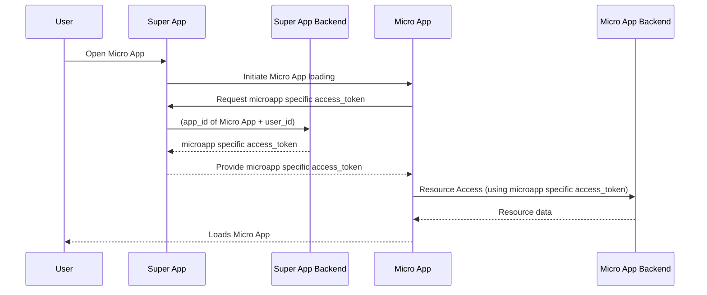

# Frontend Developer Onboarding Guide.   

This guide provides project setup, architecture, communication flows, and essential development practices. 
 
## 🚀 Getting Started


### Prerequisites

Before setting up the project, ensure you have the following installed:

- **Node.js** (v18 or higher)
- **npm** or **yarn** package manager
- **Expo CLI**: `npm install -g @expo/cli`
- **Git** for version control
- **Xcode** (for iOS development on macOS)
- **Android Studio** (for Android development)

### Project Setup

1. **Clone the Repository**
   ```bash
   git clone <repository-url>
   cd gov-sup-app/superapp-mobile/frontend
   ```

2. **Install Dependencies**
   ```bash
   npm install
   ```

3. **Environment Configuration**
   ```bash
   cp .env.example .env
   ```

   Fill in the required environment variables in `.env`:
   ```bash
   EXPO_PUBLIC_CLIENT_ID=<project-client-id-from-idp>
   EXPO_PUBLIC_REDIRECT_URI=<redirect-uri-from-idp>
   EXPO_PUBLIC_TOKEN_URL=<token-url-from-idp>
   EXPO_PUBLIC_LOGOUT_URL=<logout-url-from-idp>
   EXPO_PUBLIC_BACKEND_BASE_URL=<backend-api-url>
   ```

4. **Start Development Server**
   ```bash
   npm start
   ```


## 🚀 Deployment

### Build Process

1. **Development Builds**
   ```bash
   # Android APK
   npx expo prebuild --platform android --clean // To pre-build the package
   npx expo run:android --variant=debug

   # iOS Simulator
   npx expo prebuild --platform ios --clean 
   npx expo run:ios
   ```
In the output, you'll find options to open the app in a

- [Development build](https://docs.expo.dev/develop/development-builds/introduction/)
- [Android emulator](https://docs.expo.dev/workflow/android-studio-emulator/)
- [iOS simulator](https://docs.expo.dev/workflow/ios-simulator/)
- [Expo Go](https://expo.dev/go), a limited sandbox for trying out app development with Expo

You can start development by editing the files inside the **app** directory. This project uses [file-based routing](https://docs.expo.dev/router/introduction).   

2. **Production Builds**
   ```bash
   # Using EAS Build
   npx eas build --platform android
   npx eas build --platform ios

   # Or using Expo Application Services
   npx expo build:android
   npx expo build:ios
   ```

## Available Scripts

```bash
# Start Expo development server
npm start

# Run on Android emulator/device
npm run android

# Run on iOS simulator/device
npm run ios

# Run on web browser
npm run web

# Run unit tests
npm test

# Run tests in watch mode
npm test -- --watch

# Run tests with coverage
npm test -- --coverage

# Lint code
npm run lint

# Fix linting issues
npm run lint:fix
```


---

## 🏗️ Architecture Overview

### Technology Stack

- **Framework**: React Native with Expo
- **Language**: TypeScript
- **Navigation**: Expo Router (file-based routing)
- **State Management**: Redux Toolkit + Redux Persist
- **Authentication**: IAM (OAuth 2.0 / OIDC)
- **Storage**: AsyncStorage for local persistence
- **Styling**: React Native Paper + Custom components
- **HTTP Client**: Axios

### Project Structure

```
frontend/
├── app/                    # Expo Router pages (file-based routing)
│   ├── _layout.tsx         # Root layout
│   ├── (tabs)/             # Tab navigation
│   ├── login.tsx           # Authentication screen
│   └── micro-app.tsx       # Micro-app container
├── components/             # Reusable UI components
├── services/               # API services and business logic
├── context/                # Redux store and slices
├── utils/                  # Utility functions and helpers
├── types/                  # TypeScript type definitions
├── constants/              # App constants and configuration
├── hooks/                  # Custom React hooks
└── assets/                 # Images, fonts, and other assets
```


<!-- #### How Micro-App Updates Work

- The Super App Store checks for updates.
- If an update is available, the micro-app is re-downloaded and replaced. -->

---
## 🔄 Super App Mobile Flow

### **High-Level Overview**

1. User installs & opens the app for the first time

   - If user **is not authenticated**, Prompt to **Sign In** is displayed.

2. If user signs in:

   - Retrieve **access_token & refresh_token** via **Asgardeo IAM**.
   - Fetch **detailed user info**.


2. Default landing tab is `Home`

   - user installed apps are shown.

3. User can navigate:

   - To **Store** tab → App management functions (install, download). 
   - To **Profile** tab → Profile details and sign-out option.


4. On re-open, the app:

   - Starts at **Home** tab.
   <!-- TODO : update mechanism
    - Checks for a **Super App force update**. If required, shows update screen.
   - Checks if any **micro-apps have updates** and updates them automatically. -->


## 🔄 Communication Flows


### 2. MicroApp Launch Flow


```mermaid
sequenceDiagram
    participant User
    participant Super App
    participant Super App Backend
    participant Micro App

    User ->> Super App: Open Micro App
    Super App ->> Micro App: Initiate Micro App loading
    Micro App ->> Super App: Request microapp specific access_token
    Super App ->> Super App Backend: (app_id of Micro App + user_id)
    Super App Backend -->> Super App: microapp specific access_token
    Super App -->> Micro App: Provide microapp specific access_token
    Micro App ->> Micro App Backend: Resource Access (using microapp specific access_token)
    Micro App Backend -->> Micro App: Resource data
    Micro App -->> User: Loads Micro App
```

---


## 🔧 Development Workflow

### 🔐 Token storage and lifecycle

The app persists certain authentication artifacts to support seamless sign‑in and micro‑app access.

#### What we store
- Main app tokens (OIDC/OAuth)
   - access_token, refresh_token, id_token, expiry, and basic user profile
   - Stored under `AUTH_DATA` in AsyncStorage (see `services/authService.ts`)
- Micro‑app access tokens
   - Short‑lived tokens per micro‑app and user
   - Cached in AsyncStorage with a namespaced key (see `services/microAppTokenService.ts`)
- Google integration tokens (if enabled)
   - Google access_token, refresh_token, and user info
   - Stored under `GOOGLE_*` keys in AsyncStorage (see `services/googleService.ts`)

#### When we write
- After successful login or token refresh
   - `authService.ts` persists `AUTH_DATA`
- When a micro‑app requests a token
   - `microAppTokenService.ts` fetches and caches a micro‑app token with expiry
- After Google sign‑in or refresh
   - `googleService.ts` writes Google tokens and user info

#### When we clear
- On logout
   - `utils/performLogout.ts` purges Redux state, removes `AUTH_DATA`, `USER_INFO`, and clears all cached micro‑app tokens; then navigates to Login
- On micro‑app uninstall
   - Token entries associated with the app are removed
- On token refresh/expiry
   - Old entries are replaced with new values and updated expiries
- On app uninstall/reinstall
   - Mobile OS clears the app sandbox (AsyncStorage included); platform backup/restore settings may re‑seed state depending on user/device configuration

#### Risk note (AsyncStorage)
- AsyncStorage is a plaintext key‑value store; it is not hardware‑backed encryption. On rooted/jailbroken devices, or with malware-level access, secrets can be at risk.
- Current mitigations: logout clears secrets; tokens are time‑limited; micro‑app tokens are scoped per app.
- Recommended improvement: migrate sensitive secrets (access/refresh/ID tokens, micro‑app tokens, Google tokens) to Expo SecureStore (Keychain/Keystore) and minimize the duration they are stored at rest.


### Code Organization

#### Components
- Use functional components with TypeScript
- Follow component naming conventions: `PascalCase`
- Separate business logic into custom hooks
- Use React Native Paper for consistent UI

#### Services
- Keep API calls in dedicated service files
- Use async/await for asynchronous operations
- Implement proper error handling
- Add TypeScript interfaces for API responses


### 🐛 Debugging & Troubleshooting


#### Build Issues
```bash
# Clear Expo cache
npx expo start --clear

# Clear Metro bundler cache
npx react-native start --reset-cache

# Clear node_modules and reinstall
rm -rf node_modules && npm install
```

#### Authentication Issues
- Verify environment variables are set correctly
- Check IdP configuration
- Ensure redirect URIs match

#### Network Issues
- Verify API endpoints are accessible
- Check network permissions in app configuration
- Use Charles Proxy or similar for network debugging

### Development Tools

- **Expo Dev Client**: Enhanced development experience
- **React Native Debugger**: Advanced debugging capabilities
- **Flipper**: Mobile app debugging platform
- **Charles Proxy**: Network traffic inspection

---

## 📚 Additional Resources

### Documentation
- [Expo Documentation](https://docs.expo.dev/)
- [React Native Documentation](https://reactnative.dev/docs)
- [Redux Toolkit Documentation](https://redux-toolkit.js.org/)
- [TypeScript Handbook](https://www.typescriptlang.org/docs/)

### Key Files to Review
- `docs/BRIDGE_GUIDE.md`: MicroApp communication
- `services/authService.ts`: Authentication logic
- `context/slices/appSlice.ts`: State management
- `utils/bridge.ts`: Bridge implementation
- `constants/Constants.ts`: App configuration

### Getting Help
- Check existing issues in the repository
- Review pull request discussions
- Reach out to the development team
- Consult the Bridge Guide for MicroApp integration

---

*This guide is maintained by the SuperApp development team. Last updated: September 2025*</content>.  
<parameter name="filePath">/superapp-mobile/docs/README.md