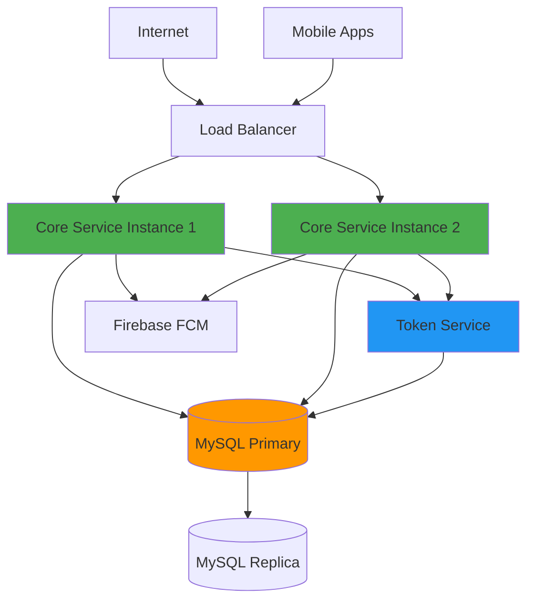
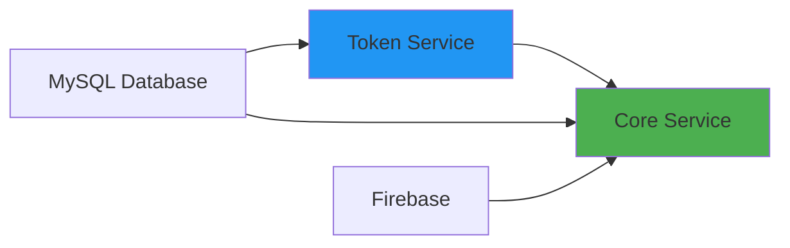

# Backend Services - Deployment Guide

## Table of Contents
- [Overview](#overview)
- [Deployment Architecture](#deployment-architecture)
- [Prerequisites](#prerequisites)
- [Environment Configuration](#environment-configuration)
- [Database Setup](#database-setup)
- [Service Deployment](#service-deployment)
- [Docker Deployment](#docker-deployment)
- [Kubernetes Deployment](#kubernetes-deployment)
- [Health Checks & Monitoring](#health-checks--monitoring)
- [Secrets Management](#secrets-management)
- [Scaling Considerations](#scaling-considerations)
- [Troubleshooting](#troubleshooting)

---

## Overview

This guide covers production deployment of the LSF Super App backend services. The platform consists of two microservices that must be deployed in a specific order with proper configuration.

**Services:**
1. **Token Service** (Port 8081) - Internal IDP for authentication
2. **Core Service** (Port 9090) - Main business logic API

---

## Deployment Architecture

### Production Architecture



### Service Dependencies



**Startup Order:**
1. MySQL Database
2. Token Service
3. Core Service

---

## Prerequisites

### Infrastructure Requirements

| Component | Minimum | Recommended |
|-----------|---------|-------------|
| **CPU** | 2 cores | 4 cores |
| **RAM** | 2 GB | 4 GB |
| **Storage** | 20 GB | 50 GB SSD |
| **Network** | 100 Mbps | 1 Gbps |

### Software Requirements

- **OS:** Linux (Ubuntu 20.04+ / RHEL 8+ / Amazon Linux 2)
- **Go:** 1.25.4 or higher
- **MySQL:** 8.0 or higher
- **Docker:** 20.10+ (if using containers)
- **Kubernetes:** 1.24+ (if using K8s)

### External Services

- **Firebase Project:** With Admin SDK credentials
- **Asgardeo Account:** For user authentication (optional)
- **SSL Certificates:** For HTTPS (recommended)

---

## Environment Configuration

### Token Service Environment Variables

Create `/etc/token-service/.env`:

```bash
# Server Configuration
PORT=8081

# Database Configuration
DB_USER=tokenservice
DB_PASSWORD=<SECURE_PASSWORD>
DB_HOST=mysql.internal.example.com
DB_PORT=3306
DB_NAME=superapp_production

# Key Configuration (Production - Directory Mode)
KEYS_DIR=/etc/token-service/keys
ACTIVE_KEY_ID=prod-key-20251203

# Token Configuration
TOKEN_EXPIRY_SECONDS=3600
```

### Core Service Environment Variables

Create `/etc/core-service/.env`:

```bash
# Database Configuration
DB_USER=coreservice
DB_PASSWORD=<SECURE_PASSWORD>
DB_HOST=mysql.internal.example.com
DB_PORT=3306
DB_NAME=superapp_production
DB_MAX_OPEN_CONNS=50
DB_MAX_IDLE_CONNS=10
DB_CONN_MAX_LIFETIME_MIN=30
DB_CONN_MAX_IDLE_TIME_MIN=5
DB_CONNECT_RETRIES=5

# Server Configuration
SERVER_PORT=9090

# External IDP (Asgardeo)
EXTERNAL_IDP_JWKS_URL=https://api.asgardeo.io/t/your-org/oauth2/jwks
EXTERNAL_IDP_ISSUER=https://api.asgardeo.io/t/your-org/oauth2/token
EXTERNAL_IDP_AUDIENCE=your-production-client-id

# Internal IDP (Token Service)
INTERNAL_IDP_BASE_URL=http://token-service.internal:8081
INTERNAL_IDP_ISSUER=superapp-idp
INTERNAL_IDP_AUDIENCE=superapp-api

# Service Configuration
USER_SERVICE_TYPE=db
FILE_SERVICE_TYPE=db

# Firebase Configuration
FIREBASE_CREDENTIALS_PATH=/etc/core-service/firebase-admin-key.json
```

> [!WARNING]
> **Security:** Never commit `.env` files to version control. Use secret management systems in production.

---

## Database Setup

### 1. Create Production Database

```sql
-- Connect to MySQL
mysql -u root -p

-- Create database with proper charset
CREATE DATABASE superapp_production 
  CHARACTER SET utf8mb4 
  COLLATE utf8mb4_unicode_ci;

-- Create service users
CREATE USER 'tokenservice'@'%' IDENTIFIED BY '<SECURE_PASSWORD>';
CREATE USER 'coreservice'@'%' IDENTIFIED BY '<SECURE_PASSWORD>';

-- Grant permissions
GRANT ALL PRIVILEGES ON superapp_production.* TO 'tokenservice'@'%';
GRANT ALL PRIVILEGES ON superapp_production.* TO 'coreservice'@'%';

FLUSH PRIVILEGES;
```

### 2. Run Migrations

```bash
# Run core service migrations
mysql -u coreservice -p superapp_production < /path/to/services/core/migrations/001_init_schema.sql

# Verify tables
mysql -u coreservice -p superapp_production -e "SHOW TABLES;"
```

### 3. Database Backup Strategy

```bash
# Daily backup script
#!/bin/bash
BACKUP_DIR="/var/backups/mysql"
DATE=$(date +%Y%m%d_%H%M%S)

mysqldump -u backup_user -p<PASSWORD> \
  --single-transaction \
  --routines \
  --triggers \
  superapp_production > $BACKUP_DIR/superapp_$DATE.sql

# Compress
gzip $BACKUP_DIR/superapp_$DATE.sql

# Keep only last 30 days
find $BACKUP_DIR -name "superapp_*.sql.gz" -mtime +30 -delete
```

---

## Service Deployment

### Option 1: Systemd Service (Recommended for VMs)

#### Token Service

Create `/etc/systemd/system/token-service.service`:

```ini
[Unit]
Description=Token Service (Internal IDP)
After=network.target mysql.service
Requires=mysql.service

[Service]
Type=simple
User=tokenservice
Group=tokenservice
WorkingDirectory=/opt/token-service
EnvironmentFile=/etc/token-service/.env
ExecStart=/opt/token-service/bin/token-service
Restart=always
RestartSec=10
StandardOutput=journal
StandardError=journal
SyslogIdentifier=token-service

# Security
NoNewPrivileges=true
PrivateTmp=true
ProtectSystem=strict
ProtectHome=true
ReadWritePaths=/var/log/token-service

[Install]
WantedBy=multi-user.target
```

#### Core Service

Create `/etc/systemd/system/core-service.service`:

```ini
[Unit]
Description=Core Service (Main API)
After=network.target mysql.service token-service.service
Requires=mysql.service
Wants=token-service.service

[Service]
Type=simple
User=coreservice
Group=coreservice
WorkingDirectory=/opt/core-service
EnvironmentFile=/etc/core-service/.env
ExecStart=/opt/core-service/bin/core-service
Restart=always
RestartSec=10
StandardOutput=journal
StandardError=journal
SyslogIdentifier=core-service

# Security
NoNewPrivileges=true
PrivateTmp=true
ProtectSystem=strict
ProtectHome=true
ReadWritePaths=/var/log/core-service

[Install]
WantedBy=multi-user.target
```

#### Deploy and Start

```bash
# Create service users
sudo useradd -r -s /bin/false tokenservice
sudo useradd -r -s /bin/false coreservice

# Create directories
sudo mkdir -p /opt/token-service/bin /opt/core-service/bin
sudo mkdir -p /etc/token-service/keys /etc/core-service
sudo mkdir -p /var/log/token-service /var/log/core-service

# Copy binaries
sudo cp token-service /opt/token-service/bin/
sudo cp core-service /opt/core-service/bin/

# Set permissions
sudo chown -R tokenservice:tokenservice /opt/token-service
sudo chown -R coreservice:coreservice /opt/core-service
sudo chmod 755 /opt/token-service/bin/token-service
sudo chmod 755 /opt/core-service/bin/core-service

# Copy configuration
sudo cp .env /etc/token-service/
sudo cp .env /etc/core-service/
sudo cp firebase-admin-key.json /etc/core-service/
sudo chmod 600 /etc/token-service/.env /etc/core-service/.env

# Reload systemd
sudo systemctl daemon-reload

# Enable and start services
sudo systemctl enable token-service
sudo systemctl enable core-service
sudo systemctl start token-service
sudo systemctl start core-service

# Check status
sudo systemctl status token-service
sudo systemctl status core-service

# View logs
sudo journalctl -u token-service -f
sudo journalctl -u core-service -f
```

---

## Docker Deployment

### Docker Compose

Create `docker-compose.yml`:

```yaml
version: '3.8'

services:
  mysql:
    image: mysql:8.0
    environment:
      MYSQL_ROOT_PASSWORD: ${MYSQL_ROOT_PASSWORD}
      MYSQL_DATABASE: superapp_production
    volumes:
      - mysql_data:/var/lib/mysql
      - ./services/core/migrations:/docker-entrypoint-initdb.d
    ports:
      - "3306:3306"
    healthcheck:
      test: ["CMD", "mysqladmin", "ping", "-h", "localhost"]
      interval: 10s
      timeout: 5s
      retries: 5

  token-service:
    build:
      context: ./services/token-service
      dockerfile: Dockerfile
    environment:
      - PORT=8081
      - DB_HOST=mysql
      - DB_PORT=3306
      - DB_NAME=superapp_production
      - DB_USER=${TOKEN_DB_USER}
      - DB_PASSWORD=${TOKEN_DB_PASSWORD}
      - KEYS_DIR=/app/keys
      - ACTIVE_KEY_ID=${ACTIVE_KEY_ID}
    volumes:
      - ./keys:/app/keys:ro
    ports:
      - "8081:8081"
    depends_on:
      mysql:
        condition: service_healthy
    healthcheck:
      test: ["CMD", "wget", "--quiet", "--tries=1", "--spider", "http://localhost:8081/.well-known/jwks.json"]
      interval: 30s
      timeout: 10s
      retries: 3

  core-service:
    build:
      context: ./services/core
      dockerfile: Dockerfile
    environment:
      - SERVER_PORT=9090
      - DB_HOST=mysql
      - DB_PORT=3306
      - DB_NAME=superapp_production
      - DB_USER=${CORE_DB_USER}
      - DB_PASSWORD=${CORE_DB_PASSWORD}
      - INTERNAL_IDP_BASE_URL=http://token-service:8081
      - FIREBASE_CREDENTIALS_PATH=/app/firebase-admin-key.json
    volumes:
      - ./firebase-admin-key.json:/app/firebase-admin-key.json:ro
    ports:
      - "9090:9090"
    depends_on:
      token-service:
        condition: service_healthy
    healthcheck:
      test: ["CMD", "wget", "--quiet", "--tries=1", "--spider", "http://localhost:9090/api/v1/health"]
      interval: 30s
      timeout: 10s
      retries: 3

volumes:
  mysql_data:
```

Deploy:

```bash
# Create .env file for Docker Compose
cat > .env << EOF
MYSQL_ROOT_PASSWORD=<SECURE_PASSWORD>
TOKEN_DB_USER=tokenservice
TOKEN_DB_PASSWORD=<SECURE_PASSWORD>
CORE_DB_USER=coreservice
CORE_DB_PASSWORD=<SECURE_PASSWORD>
ACTIVE_KEY_ID=prod-key-20251203
EOF

# Start services
docker-compose up -d

# View logs
docker-compose logs -f

# Check status
docker-compose ps
```

---

## Kubernetes Deployment

### Namespace and Secrets

```yaml
# namespace.yaml
apiVersion: v1
kind: Namespace
metadata:
  name: superapp
---
# secrets.yaml
apiVersion: v1
kind: Secret
metadata:
  name: database-credentials
  namespace: superapp
type: Opaque
stringData:
  mysql-root-password: <SECURE_PASSWORD>
  token-db-password: <SECURE_PASSWORD>
  core-db-password: <SECURE_PASSWORD>
---
apiVersion: v1
kind: Secret
metadata:
  name: firebase-credentials
  namespace: superapp
type: Opaque
data:
  firebase-admin-key.json: <BASE64_ENCODED_JSON>
```

### MySQL Deployment

```yaml
# mysql-deployment.yaml
apiVersion: v1
kind: PersistentVolumeClaim
metadata:
  name: mysql-pvc
  namespace: superapp
spec:
  accessModes:
    - ReadWriteOnce
  resources:
    requests:
      storage: 50Gi
---
apiVersion: apps/v1
kind: Deployment
metadata:
  name: mysql
  namespace: superapp
spec:
  replicas: 1
  selector:
    matchLabels:
      app: mysql
  template:
    metadata:
      labels:
        app: mysql
    spec:
      containers:
      - name: mysql
        image: mysql:8.0
        env:
        - name: MYSQL_ROOT_PASSWORD
          valueFrom:
            secretKeyRef:
              name: database-credentials
              key: mysql-root-password
        - name: MYSQL_DATABASE
          value: superapp_production
        ports:
        - containerPort: 3306
        volumeMounts:
        - name: mysql-storage
          mountPath: /var/lib/mysql
      volumes:
      - name: mysql-storage
        persistentVolumeClaim:
          claimName: mysql-pvc
---
apiVersion: v1
kind: Service
metadata:
  name: mysql
  namespace: superapp
spec:
  ports:
  - port: 3306
  selector:
    app: mysql
```

### Token Service Deployment

```yaml
# token-service-deployment.yaml
apiVersion: apps/v1
kind: Deployment
metadata:
  name: token-service
  namespace: superapp
spec:
  replicas: 2
  selector:
    matchLabels:
      app: token-service
  template:
    metadata:
      labels:
        app: token-service
    spec:
      containers:
      - name: token-service
        image: your-registry/token-service:latest
        env:
        - name: PORT
          value: "8081"
        - name: DB_HOST
          value: mysql
        - name: DB_USER
          value: tokenservice
        - name: DB_PASSWORD
          valueFrom:
            secretKeyRef:
              name: database-credentials
              key: token-db-password
        ports:
        - containerPort: 8081
        livenessProbe:
          httpGet:
            path: /.well-known/jwks.json
            port: 8081
          initialDelaySeconds: 30
          periodSeconds: 10
        readinessProbe:
          httpGet:
            path: /.well-known/jwks.json
            port: 8081
          initialDelaySeconds: 5
          periodSeconds: 5
---
apiVersion: v1
kind: Service
metadata:
  name: token-service
  namespace: superapp
spec:
  ports:
  - port: 8081
    targetPort: 8081
  selector:
    app: token-service
```

### Core Service Deployment

```yaml
# core-service-deployment.yaml
apiVersion: apps/v1
kind: Deployment
metadata:
  name: core-service
  namespace: superapp
spec:
  replicas: 3
  selector:
    matchLabels:
      app: core-service
  template:
    metadata:
      labels:
        app: core-service
    spec:
      containers:
      - name: core-service
        image: your-registry/core-service:latest
        env:
        - name: SERVER_PORT
          value: "9090"
        - name: DB_HOST
          value: mysql
        - name: DB_USER
          value: coreservice
        - name: DB_PASSWORD
          valueFrom:
            secretKeyRef:
              name: database-credentials
              key: core-db-password
        - name: INTERNAL_IDP_BASE_URL
          value: http://token-service:8081
        - name: FIREBASE_CREDENTIALS_PATH
          value: /etc/firebase/firebase-admin-key.json
        ports:
        - containerPort: 9090
        volumeMounts:
        - name: firebase-credentials
          mountPath: /etc/firebase
          readOnly: true
        livenessProbe:
          httpGet:
            path: /api/v1/health
            port: 9090
          initialDelaySeconds: 30
          periodSeconds: 10
        readinessProbe:
          httpGet:
            path: /api/v1/health
            port: 9090
          initialDelaySeconds: 5
          periodSeconds: 5
      volumes:
      - name: firebase-credentials
        secret:
          secretName: firebase-credentials
---
apiVersion: v1
kind: Service
metadata:
  name: core-service
  namespace: superapp
spec:
  type: LoadBalancer
  ports:
  - port: 80
    targetPort: 9090
  selector:
    app: core-service
```

Deploy to Kubernetes:

```bash
# Apply configurations
kubectl apply -f namespace.yaml
kubectl apply -f secrets.yaml
kubectl apply -f mysql-deployment.yaml
kubectl apply -f token-service-deployment.yaml
kubectl apply -f core-service-deployment.yaml

# Check status
kubectl get pods -n superapp
kubectl get services -n superapp

# View logs
kubectl logs -f deployment/token-service -n superapp
kubectl logs -f deployment/core-service -n superapp
```

---

## Health Checks & Monitoring

### Health Check Endpoints

| Service | Endpoint | Expected Response |
|---------|----------|-------------------|
| Token Service | `GET /.well-known/jwks.json` | 200 OK with JWKS |
| Core Service | `GET /api/v1/health` | 200 OK |

### Monitoring Script

```bash
#!/bin/bash
# health-check.sh

check_service() {
    local name=$1
    local url=$2
    
    if curl -sf "$url" > /dev/null; then
        echo "✓ $name is healthy"
        return 0
    else
        echo "✗ $name is down"
        return 1
    fi
}

check_service "Token Service" "http://localhost:8081/.well-known/jwks.json"
check_service "Core Service" "http://localhost:9090/api/v1/health"
```

### Prometheus Metrics (Optional)

Add metrics endpoint to services for Prometheus scraping.

---

## Secrets Management

### AWS Secrets Manager

```bash
# Store database password
aws secretsmanager create-secret \
    --name superapp/db/password \
    --secret-string "your-secure-password"

# Retrieve in application
DB_PASSWORD=$(aws secretsmanager get-secret-value \
    --secret-id superapp/db/password \
    --query SecretString \
    --output text)
```

### HashiCorp Vault

```bash
# Store secret
vault kv put secret/superapp/db password="your-secure-password"

# Retrieve secret
vault kv get -field=password secret/superapp/db
```

---

## Scaling Considerations

### Horizontal Scaling

- **Core Service:** Can scale horizontally (stateless)
- **Token Service:** Can scale horizontally (stateless)
- **Database:** Use read replicas for read-heavy workloads

### Load Balancing

Use NGINX or cloud load balancers:

```nginx
upstream core_service {
    server core-1:9090;
    server core-2:9090;
    server core-3:9090;
}

server {
    listen 80;
    location / {
        proxy_pass http://core_service;
    }
}
```

---

## Troubleshooting

### Service Won't Start

```bash
# Check logs
sudo journalctl -u core-service -n 100
sudo journalctl -u token-service -n 100

# Check configuration
cat /etc/core-service/.env
cat /etc/token-service/.env

# Test database connection
mysql -h <DB_HOST> -u coreservice -p
```

### High Memory Usage

```bash
# Check memory
free -h
docker stats

# Adjust connection pool
DB_MAX_OPEN_CONNS=25
DB_MAX_IDLE_CONNS=5
```

---

## Support

For development setup, see:
- [Core Service Developer Guide](./core/DEVELOPER_GUIDE.md)
- [Token Service Developer Guide](./token-service/DEVELOPER_GUIDE.md)
- [Services Overview](./README.md)
