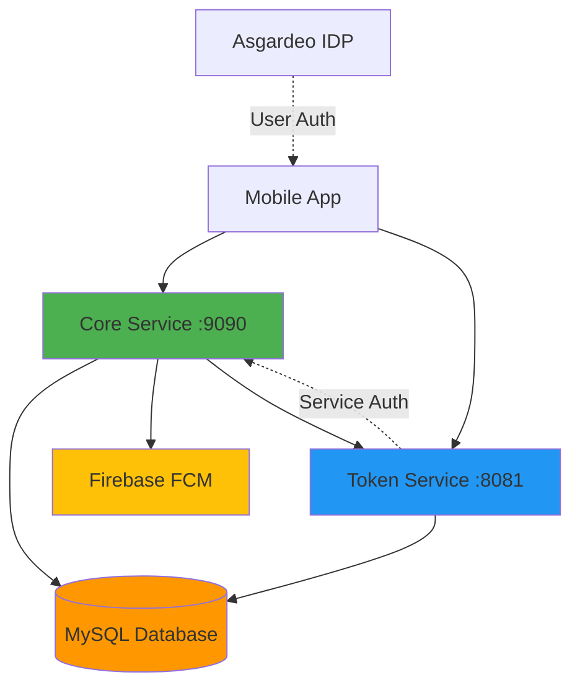
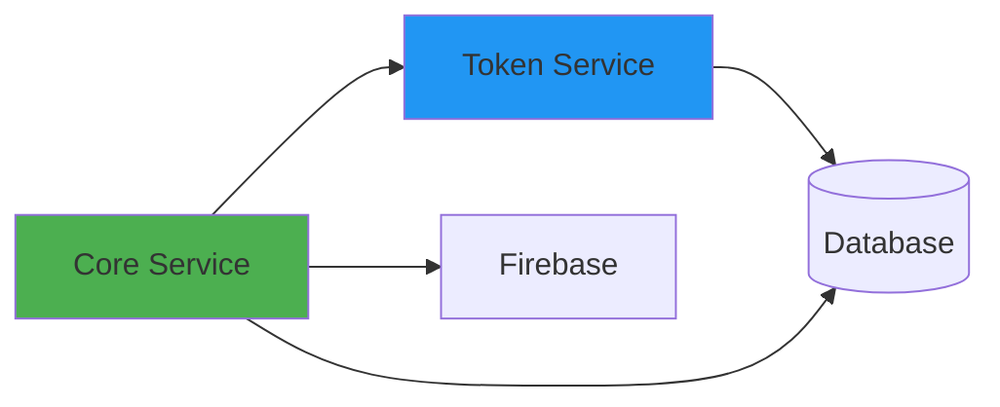

# Backend Services

This directory contains all backend services for the LSF Super App platform. The services are designed to be independently deployable microservices that work together to power the mobile application.

## Architecture Overview



## Services

### 🚀 Core Service (`services/core/`)
**Port:** 9090  
**Purpose:** Main backend API service that handles all business logic for the super app

**Key Features:**
- Microapp management and versioning
- User configuration and preferences
- Push notifications via Firebase
- File storage and management
- Dual IDP authentication (Asgardeo + internal token service)

**Tech Stack:** Go, Chi Router, GORM, Firebase Admin SDK

[📖 Developer Guide](./core/DEVELOPER_GUIDE.md) | [📊 API Docs](http://localhost:9090/swagger/index.html)

---

### 🔐 Token Service (`services/token-service/`)
**Port:** 8081  
**Purpose:** Internal Identity Provider for service-to-service authentication

**Key Features:**
- JWT token generation and validation
- JWKS endpoint for public key distribution
- Zero-downtime key rotation support
- OAuth2 client credentials flow
- User token exchange for microapp frontends

**Tech Stack:** Go, Chi Router, GORM, JWT

[📖 Developer Guide](./token-service/DEVELOPER_GUIDE.md) | [📊 API Docs](http://localhost:8081/swagger/index.html)

---

## Quick Start

### Prerequisites
- **Go:** 1.25.4 or higher
- **MySQL:** 8.0 or higher
- **Firebase:** Admin SDK credentials (for core service)

### 1. Database Setup

```bash
# Create database
mysql -u root -p
CREATE DATABASE superapp_db;
exit

# Run migrations
cd services/core
mysql -u root -p superapp_db < migrations/001_init_schema.sql
```

### 2. Start Token Service

```bash
cd services/token-service

# Copy and configure environment
cp .env.example .env
# Edit .env with your database credentials

# Generate RSA keys
./scripts/generate-keys.sh

# Run service
go run cmd/server/main.go
```

Token service will be available at `http://localhost:8081`

### 3. Start Core Service

```bash
cd services/core

# Copy and configure environment
cp .env.example .env
# Edit .env with:
# - Database credentials
# - Firebase credentials path
# - Token service URL (http://localhost:8081)

# Run service
go run cmd/server/main.go
```

Core service will be available at `http://localhost:9090`

### 4. Verify Setup

```bash
# Check token service health
curl http://localhost:8081/.well-known/jwks.json

# Check core service health
curl http://localhost:9090/api/v1/health
```

---

## Service Dependencies



**Startup Order:**
1. Database (MySQL)
2. Token Service
3. Core Service

---

## Development Workflow

### Running with Hot Reload

```bash
# Install air for hot reload
go install github.com/air-verse/air@latest

# Run core service with hot reload
cd services/core
air

# Run token service with hot reload
cd services/token-service
air
```

### Running Tests

```bash
# Test all services
cd services/core && go test ./...
cd services/token-service && go test ./...

# Test with coverage
go test -cover ./...
```

### Generating API Documentation

```bash
# Install swag
go install github.com/swaggo/swag/cmd/swag@latest

# Generate docs for core service
cd services/core
swag init -g cmd/server/main.go

# Generate docs for token service
cd services/token-service
swag init -g cmd/server/main.go
```

---

## API Documentation

Both services expose Swagger UI for interactive API documentation:

- **Core Service:** http://localhost:9090/swagger/index.html
- **Token Service:** http://localhost:8081/swagger/index.html

---

## Environment Variables

### Core Service
See [services/core/.env.example](./core/.env.example) for all configuration options.

Key variables:
- `DB_*` - Database connection
- `SERVER_PORT` - HTTP server port
- `INTERNAL_IDP_BASE_URL` - Token service URL
- `EXTERNAL_IDP_*` - Asgardeo configuration
- `FIREBASE_CREDENTIALS_PATH` - Firebase admin SDK path

### Token Service
See [services/token-service/.env.example](./token-service/.env.example) for all configuration options.

Key variables:
- `DB_*` - Database connection
- `PORT` - HTTP server port
- `KEYS_DIR` - Directory containing RSA key pairs
- `ACTIVE_KEY_ID` - ID of the active signing key

---

## Deployment

For production deployment instructions, see [DEPLOYMENT_GUIDE.md](./DEPLOYMENT_GUIDE.md)

---

## Troubleshooting

### Common Issues

**Database connection failed**
- Verify MySQL is running: `mysql -u root -p`
- Check credentials in `.env` file
- Ensure database exists: `SHOW DATABASES;`

**Token service JWKS not found**
- Generate keys: `cd services/token-service && ./scripts/generate-keys.sh`
- Verify keys directory: `ls -la keys/dev/`

**Firebase initialization failed**
- Check `FIREBASE_CREDENTIALS_PATH` in core service `.env`
- Verify JSON file exists and is valid
- Ensure file has proper read permissions

**Port already in use**
- Check running processes: `lsof -i :9090` or `lsof -i :8081`
- Kill process: `kill -9 <PID>`
- Or change port in `.env` file

---

## Contributing

### Adding a New Endpoint

1. Define DTOs in `internal/api/v1/dto/`
2. Add handler in `internal/api/v1/handler/`
3. Register route in `internal/api/v1/router/router.go`
4. Add Swagger annotations
5. Regenerate docs: `swag init -g cmd/server/main.go`
6. Add tests

### Code Style

- Follow Go best practices and idioms
- Use `gofmt` for formatting
- Add comments for exported functions
- Write unit tests for business logic

---

## Support

For detailed service-specific information:
- [Core Service Developer Guide](./core/DEVELOPER_GUIDE.md)
- [Token Service Developer Guide](./token-service/DEVELOPER_GUIDE.md)
- [Deployment Guide](./DEPLOYMENT_GUIDE.md)
