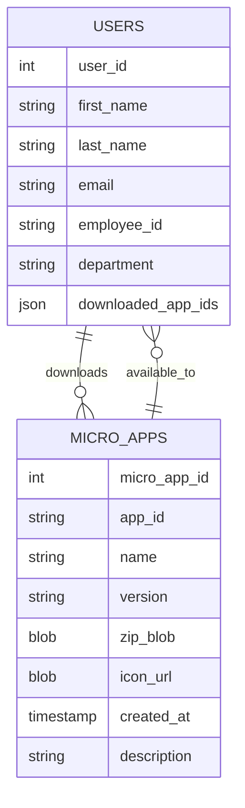

<p align="left">
  <a href="https://opensource.org/license/apache-2-0">
    
  </a>
</p>

## Superapp Backend

Backend service for Superapp Mobile, implemented in Ballerina. It provides:
- JWT-protected HTTP APIs for users and micro-apps
- Micro-app upload (multipart), metadata listing, ZIP download, and icon serving
- Per-micro-app JWT minting for downstream services
- MySQL database integration with SSL and connection pooling


### Tech Stack
- Ballerina 2201.12.9 (Swan Lake)
- MySQL (via `ballerinax/mysql`)
- JWT (sign/validate), HTTP service and interceptors

### Repository Layout
- `main.bal`: HTTP service, routes, interceptors, and JWT minting
- `db_client.bal`: MySQL client and configuration
- `db_functions.bal`: Database queries (users, micro-apps, icons, zips)
- `types.bal`: Data records for users and micro-apps
- `validator.bal`: `JwtInterceptor` for request authZ via Asgardeo
- `constants.bal`: Auth-related constants and header names
- `configurations.bal`: Configurables (port, keys, issuer, TTL)
- `config.toml.example`: Sample configuration

---

## Prerequisites
- Ballerina distribution `2201.12.9` or compatible
- MySQL database and credentials
- RS256 private key (`.pem`) for signing micro-app JWTs
- Identity Provider (IdP) public certificate (`.crt`) to validate incoming JWTs (Asgardeo in example)

## Configuration
Create a `config.toml` at repo root based on `config.toml.example`.

Required entries:
```toml
# Root-level
privateKeyPath = "./<your-superapp-private-key>.pem"
publicKeyPath = "./<your-idp-certificate>.crt"

[databaseConfig]
host = "<your-db-host-name>"
user = "<your-db_admin-name>"
password = "<your-db-password>"
database = "<your-db-name>"
port = <port>
```

Service configurables (defaults in `configurations.bal`):
- `serverPort` (int, default 9090)
- `maxHeaderSize` (int, default 16384)
- `superappIssuer` (string, default `"superapp-issuer"`)
- `tokenTTLSeconds` (decimal, default `300`)
- `privateKeyPath` (string, required)
- `publicKeyPath` (string, required)

Database client uses SSL preferred and a 10s connect timeout by default.

## Running Locally
Install prerequisites, then run:
```bash
bal run
```

On first run, Ballerina downloads dependencies and starts the HTTP listener on `serverPort`.

## Building
```bash
bal build
```
Artifacts:
- `target/bin/superapp_backend.jar`

## Authentication & Security
- Incoming requests are validated by `JwtInterceptor` using `x-jwt-assertion` header.
  - Issuer: `ISSUER`
  - Audience: `AUDIENCE_1` and `AUDIENCE_2`
  - Signature certificate: `publicKeyPath`
- Outgoing micro-app tokens are minted by `createMicroappJWT(empId, microAppId)` using RS256 and `privateKeyPath`.
- CORS is open by default (allowOrigins `*`). Review before production.

Headers:
- `x-jwt-assertion: <jwt-id-token>` required by all protected routes.

## Database Schema Expectations



The service expects (at minimum) tables with columns used in queries:
- `users(user_id, first_name, last_name, email, employee_id, department, downloaded_app_ids JSON NULL)`
- `micro_apps(micro_app_id, app_id, name, version, zip_blob BLOB, icon_url BLOB NULL, created_at TIMESTAMP DEFAULT CURRENT_TIMESTAMP, description TEXT NULL)`
  - `app_id` should be unique for upsert behavior in upload

## API Reference
Base path: `/`

Security: All endpoints require header `x-jwt-assertion: <jwt>` unless noted. JSON responses unless noted.

## Available API Endpoints
- The following is a summary of the backend API routes, including their purpose and return types. All endpoints use JWT-based authentication.

| Endpoint | Method | Description | Response Type |
|---|---|---|---|
| `/micro-app-token?emp_id={empId}&micro_app_id={appId}` | GET | Issue a per-micro-app JWT for the given employee and app | `{ token: string, expiresAt: number }` |
| `/users` | GET | Retrieve all users | `User[]` |
| `/users/{email}` | GET | Retrieve a user by email | `User` or `404 NotFound` |
| `/users/{email}/apps` | POST | Update user's downloaded app IDs (JSON body) | `{ status: string, message: string }` |
| `/micro-apps` | GET | Retrieve all micro-apps | `MicroApp[]` |
| `/micro-apps/{appId}` | GET | Retrieve micro-app details by App ID | `MicroApp` or `404 NotFound` |
| `/micro-apps/{appId}/download` | GET | Download micro-app ZIP by App ID | Binary ZIP (`application/zip`) |
| `/icons/{iconName}` | GET | Retrieve icon by name (inline) | Binary Image (PNG/JPEG) |


## Environment Variables (Alternative)
All configurables can be supplied via environment variables supported by Ballerina (e.g., `--`, or environment variable mapping). Prefer `config.toml` for local dev.

## Deployment Notes
- Build the JAR via `bal build` and deploy in a JVM environment that can access `config.toml` and key material.
- Ensure DB connectivity and SSL requirements are met.
- Lock down CORS and validate audiences/issuer for production.

## Managing Secrets (Keys and Certificates)
Never commit private keys or certificates to source control. The service reads keys from file paths configured via `privateKeyPath` and `publicKeyPath`. In all environments, mount or materialize those files at runtime and point the paths in `config.toml` accordingly.

General guidelines:
- Keep keys as files on the container/host filesystem; set permissions to 600 and owned by the runtime user.
- Inject secrets via your platform's secret manager; do not store them as plain env vars when avoidable.
- Ensure the mounted in-container file paths match the `privateKeyPath` and `publicKeyPath` values.

Local development:
- Place `private.pem` and `idp.crt` in the project root (excluded from VCS), then set:
  - `privateKeyPath = "./private.pem"`
  - `publicKeyPath  = "./idp.crt"`

Kubernetes (generic)
Quick start:
- Create Secrets from files
- Mount as volumes in Deployment
- Point config to mounted paths
- Further reading: [Kubernetes Secrets docs](https://kubernetes.io/docs/concepts/configuration/secret/)

AWS
Quick start:
- EKS: Use K8s Secrets or AWS Secrets Manager CSI Driver to mount as files.
- ECS/Fargate:
  - Create secrets in AWS Secrets Manager or SSM Parameter Store.
  - Inject as env vars and materialize to files via entrypoint script, or use volumes if supported.
- EC2/Elastic Beanstalk:
  - Fetch from Secrets Manager on boot (instance profile), write to `/etc/superapp/keys`, `chmod 600`.
- Further reading: [AWS Secrets Manager guide](https://docs.aws.amazon.com/secretsmanager/latest/userguide/intro.html)

GCP
Quick start:
- GKE: Use K8s Secrets or Secret Manager CSI Driver to mount files.
- Cloud Run: Configure Secret mounts to files (Console -> Revisions -> Volumes) and update `config.toml` paths.
- Further reading: [GCP Secret Manager guide](https://cloud.google.com/security/products/secret-manager)

Azure
Quick start:
- AKS: Use K8s Secrets or Azure Key Vault Provider for Secrets Store CSI to mount files.
- App Service / Container Apps: Reference Key Vault secrets and materialize to files via startup script.
- Further reading: [Azure Key Vault with CSI guide](https://learn.microsoft.com/en-us/azure/key-vault/secrets/)

Choreo (WSO2 Choreo)
Quick start:
- In the Choreo Console, add Secrets for PEM and CRT (Project -> Component -> DevOps -> Configs & Secrets).
- Configure File Mounts so secrets appear as files (e.g., `/private.pem`, `/idp.crt`).
- Point config to mounted paths:
  ```toml
  privateKeyPath = "/private.pem"
  publicKeyPath  = "/idp.crt"
  ```
- Further reading: [Choreo secrets and file mounts guide](https://wso2.com/choreo/docs/devops-and-ci-cd/manage-configurations-and-secrets/)


## Troubleshooting
- 401/validation errors: Verify `x-jwt-assertion` header and IdP cert in `publicKeyPath`.
- Signing failures: Check `privateKeyPath` exists and is readable, and key is RS256.
- DB timeouts: Validate `databaseConfig` host/port and network access; increase pool/timeout if needed.
- Large uploads: Confirm reverse proxy and `maxHeaderSize`/gateway limits.

## Development Tips
- Logs use `ballerina/log`; adjust log level via Ballerina run options if needed.
- Graceful shutdown closes DB client in `stopHandler()`.

## Developer Guide: Adding New Endpoints
Follow these steps to add a new API endpoint safely and consistently:

1) Define and reuse types
- Add or update records in `types.bal` for request/response payloads.
- Prefer explicit fields and consistent naming (`snake_case` for DB columns, `camelCase` for JSON only if you map explicitly).

2) Plan database interactions
- Add parameterized queries in `db_functions.bal` (use `sql:ParameterizedQuery`).
- Stream results when reading large sets; close streams (`resultStream.close()`).
- Validate inputs before executing queries.

3) Implement the route
- Add a resource function in `main.bal` within the existing service.
- Return specific types where possible (e.g., `User|http:NotFound|http:InternalServerError`).
- Use meaningful log messages at info/error levels.

4) Authentication & authorization
- All routes are protected by `JwtInterceptor` using `x-jwt-assertion`. Do not bypass it.
- If a route must be public, discuss and document clearly (and review CORS).

5) Validation & errors
- Validate path/query/body early. Return `http:BadRequest` for client errors.
- For not found, return `http:NotFound` with a helpful message.
- For server errors, log details and return `http:InternalServerError` with a generic message.

6) Response shape and pagination
- Keep response records stable and documented in this README.
- For list endpoints, add pagination (query params `limit`/`offset`) where appropriate.

7) Configuration
- Put tunables in `configurations.bal` as `configurable` values; document defaults.


Example: minimal GET endpoint pattern
```ballerina
isolated resource function get widgets/[string id](http:RequestContext ctx)
        returns Widget|http:NotFound|http:InternalServerError {
    Widget|error result = fetchWidgetById(id);
    if result is error {
        if result.message().startsWith("No widget found") {
            return <http:NotFound>{ body: { message: "Widget not found for id: " + id } };
        }
        log:printError("Failed to fetch widget", result);
        return <http:InternalServerError>{ body: { message: "Failed to fetch widget" } };
    }
    return result;
}
```

Checklist before opening a PR
- Types declared/updated in `types.bal`
- DB access added to `db_functions.bal` (parameterized, streams closed)
- Route implemented in `main.bal` (auth enforced, errors handled)
- README API section updated if response/request changed
- Secrets managed via mounts; no credentials in code or git


